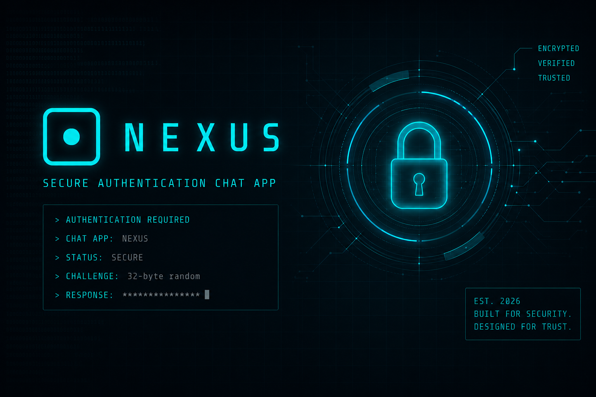

<p align="center">
  
</p>

# NEXUS

Secure Real-Time Chat Application with End-to-End Encryption.


## Overview

NEXUS is a secure real-time messaging application developed as part of an Applied Cryptography project.

The application provides:

- End-to-End Encryption (E2EE)
- X25519 Key Exchange
- NaCl Box Authenticated Encryption
- Challenge-Response Authentication
- Replay Protection
- Perfect Forward Secrecy

## Prerequisites

Before running NEXUS, ensure that the following software is installed:

### Python

NEXUS requires **Python 3.10 or newer**.

You can verify your Python installation by running:

```bash
python --version
```

or

```bash
python3 --version
```

If Python is not installed, download it from:

https://www.python.org/downloads/
## Installation

### 1. Clone the repository

```bash
git clone https://github.com/brebic1/applied_cryptography.git
cd applied_cryptography
```

### 2. Install dependencies

```bash
pip install -r requirements.txt
```

### 3. Start the server

```bash
python server.py
```

### 4. Open the client

Open `client.html` in a modern web browser in 2 or more tabs.


### 6. Register or login

Create two users and start exchanging encrypted messages.
